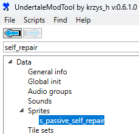
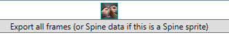
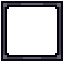
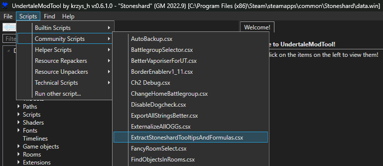

# Stonehard Talent Calculator

[](https://github.com/nstratos/stoneshard-talent-calculator/actions/workflows/deploy-to-pages.yml)

The goal of this project is to help the Stoneshard community by making it easier to share and discuss builds.  

**Live Version:** [nstratos.github.io/stoneshard-talent-calculator](https://nstratos.github.io/stoneshard-talent-calculator)

## Features

- All current ability trees are supported with logic for obtaining and refunding abilities
- Visual connectors between abilities in each tree
- Exporting builds
- Importing builds
- Sharing builds
- Tracking ability selection order
- Tooltips for abilities
- Support for formulas on tooltips
- Touch device support

## Usage  

- **Selecting Ability Trees**: Use **Ctrl + Click** (Windows/Linux) or **Cmd + Click** (Mac) to select multiple ability trees. You can also use **Shift + Click** to select a range.  
- **Choosing Abilities**: **Right-click** an ability to select it, click again to refund it. On PC, you may also use **Left-click** to refund an ability.  
- **Viewing Toolips**: On touch devices, tap and hold on an ability to reveal its tooltip. Tap on the tooltip to dismiss it. On PC, the tooltips are shown when hovering the mouse over each ability.  
- **Exporting Builds**: Click **Export**, then use the **Copy** button to copy your build code to the clipboard.  
- **Importing Builds**: Paste your build code and click **Import**. You can also import a build directly via the URL by appending `?build=<your_code>`.  
- **Sharing Builds**: Click the **Share** button to generate a shareable URL.  

## Future Work

- Support for characters and their stats
- Tracking stat selection order

## Developer Guide

To get updated text and icons directly from the game, you can use [UndertaleModTool](https://github.com/UnderminersTeam/UndertaleModTool) (UMT).

### Creating Ability Icons

1. Find the game's sprite using UMT and click **Export all frames**. The result will be a 25×24 pixel image.  
     
   

2. Upscale the sprite to 2× using **no interpolation** (for example, with GIMP). The result will be a 50×48 pixel image.

3. Add the border manually:  
   1. Open the border image (for example, with GIMP).  
      
   2. Add the upscaled sprite as a new layer in the border image. The layer order shouldn't matter.  
   3. Export the combined layers (border + upscaled sprite) as a PNG.

4. Store the PNG in the appropriate folder, for example, `img/abilities/armored_combat/`.

5. *(Optional)* If the wiki is outdated, upload the new icon to the corresponding file location, for example,  
   [https://stoneshard.com/wiki/File:Self-Repair.png](https://stoneshard.com/wiki/File:Self-Repair.png).

### Extract Tooltips

It's possible to extract the tooltips and formulas from the game data using the UMT exporter of this project.

1. From Steam, go to Stoneshard's Properties -> Betas and set Beta Participation to `modbranch - modbranch`.

2. Copy `umt-exporter/ExtractStoneshardTooltipsAndFormulas.csx` and `umt-exporter/stoneshard-skill-keys.json` from this project under `Scripts/Community Scripts` in your local UMT installation.

3. Launch UMT and Open Stoneshard `data.win`.

4. Extract tooltips using the UMT exporter. Launch the exporter by going to Scripts -> Community Scripts -> ExtractStoneshardTooltipsAndFormulas.csx as shown in the image below.
   

5. The exporter will ask for a folder to save the tooltips. It will produce a JSON file named `stoneshard-tooltips-and-formulas.json`.

### Compare Tooltips

The `tooltips/compare-tooltips.js` script can use the file generated when extracting tooltips (shown in previous section) to compare with the existing HTML tooltips in the `index.html` file and check for correctness. This makes it easier to keep the tooltips up to date.

1. Make sure you have Docker installed and running.

2. Build the container once:
   ```sh
   docker build -t compare-tooltips -f tooltips/Dockerfile .
   ```

3. Then run this script to compare the tooltips of all skills:
   ```sh
   docker run --rm -v ${PWD}/tooltips:/src/tooltips -v ${PWD}/tooltips/compare-tooltips.js:/src/compare-tooltips.js -v ${PWD}/index.html:/src/index.html compare-tooltips
   ```

4. Or to compare the tooltip of a single skill:
   ```sh
   docker run --rm -v ${PWD}/tooltips:/src/tooltips -v ${PWD}/tooltips/compare-tooltips.js:/src/compare-tooltips.js -v ${PWD}/index.html:/src/index.html compare-tooltips armored_combat 0
   ```

## Disclaimer  

This project is a **fan-made** tool for *Stoneshard*, developed by Ink Stains Games. It is **not affiliated with, endorsed, or sponsored by Ink Stains Games or any of its representatives**.  

This project may use **game assets from *Stoneshard***, such as ability icons and character portraits, which have been obtained from the official *Stoneshard* wiki. **All rights to these assets belong to Ink Stains Games or their respective owners.** These assets are used under the assumption of **fair use** for non-commercial, community-driven purposes.  

Additionally, this project displays the *Stoneshard* logo, sourced from the official *Stoneshard* wiki. The words "Talent Calculator" are added separately via HTML for clarity. This usage is purely for aesthetic purposes and does not imply official status.  

If you are a representative of Ink Stains Games and have concerns about the use of any assets, please contact us, and we will promptly remove or replace them as needed.  
