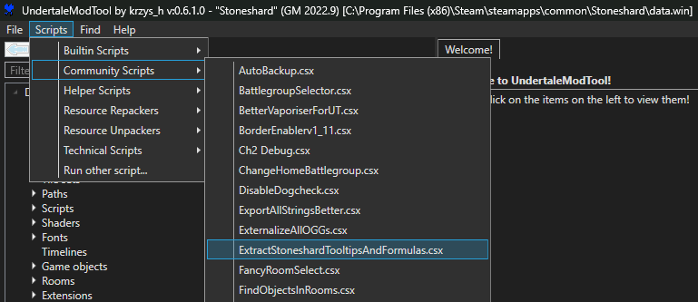
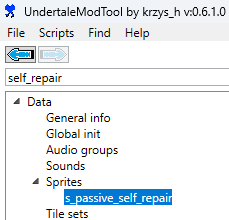
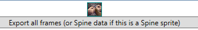
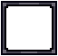

# Stonehard Talent Calculator

[](https://github.com/nstratos/stoneshard-talent-calculator/actions/workflows/deploy-to-pages.yml)

The goal of this project is to help the Stoneshard community by making it easier to share and discuss builds.

**Live Version:** [nstratos.github.io/stoneshard-talent-calculator](https://nstratos.github.io/stoneshard-talent-calculator)

## Features

- All current ability trees are supported with logic for obtaining and refunding abilities
- Visual connectors between abilities in each tree
- Exporting builds
- Importing builds
- Sharing builds
- Tracking ability obtain order
- Tracking stat increase order
- Stat increase history shown visually
- Ability points can be saved for later levels
- Tooltips for abilities
- Support for formulas on tooltips
- Touch device support

## Usage

- **Selecting Ability Trees**: Use **Ctrl + Click** (Windows/Linux) or **Cmd + Click** (Mac) to select multiple ability trees. You can also use **Shift + Click** to select a range.
- **Choosing Abilities**: **Right-click** an ability to select it, click again to refund it. On PC, you may also use **Left-click** to refund an ability.
- **Viewing Tooltips**: On touch devices, tap and hold on an ability to reveal its tooltip. Tap on the tooltip to dismiss it. On PC, the tooltips are shown when hovering the mouse over each ability.
- **Exporting Builds**: Click **Export**, then use the **Copy** button to copy your build code to the clipboard.
- **Importing Builds**: Paste your build code and click **Import**. You can also import a build directly via the URL by appending `?build=<your_code>`.
- **Sharing Builds**: Click the **Share** button to generate a shareable URL.

## Future Work

- Support for characters and their stats

## Developer Guide

To get updated text, formulas, and icons directly from the game, we can use [UndertaleModTool](https://github.com/UnderminersTeam/UndertaleModTool) (UMT).

### Extract Tooltips and Formulas

It's possible to extract the tooltips and formulas from the game data using the UMT exporter of this project.

1. From Steam, go to Stoneshard's Properties -> Betas and set Beta Participation to `modbranch - modbranch`.

2. Copy [umt-exporter/ExtractStoneshardTooltipsAndFormulas.csx](umt-exporter/ExtractStoneshardTooltipsAndFormulas.csx) and [umt-exporter/stoneshard-skill-keys.json](umt-exporter/stoneshard-skill-keys.json) from this project under `Scripts/Community Scripts` in your local UMT installation.

3. Launch UMT and Open Stoneshard `data.win`.

4. Extract tooltips using the UMT exporter. Launch the exporter by going to Scripts -> Community Scripts -> ExtractStoneshardTooltipsAndFormulas.csx as shown in the image below.
   

5. The exporter will ask for a folder to save the tooltips. It will produce a JSON file named `stoneshard-tooltips-and-formulas.json`.

You can find the exported JSON file used in the current version of the talent calculator [here](tooltips/stoneshard-tooltips-and-formulas.json).

Feel free to use the UMT exporter to get up-to-date data at anytime for your use case (e.g. updating spreadsheets and mod development).

This opens the possibility of creating automation tools that will make future updates easier even outside the scope of this project (e.g. updating the wiki tooltips).

An example of such a tool that compares and patches tooltips has been developed for this project.

### Compare or Patch Tooltips

The [tooltips/compare-tooltips.js](tooltips/compare-tooltips.js) script uses the exported JSON data from the previous section to compare with the existing HTML tooltips in [index.html](index.html).

This can be used in two ways:

- **compare mode** to inspect what changed
- **write mode** to patch `index.html` automatically

Before running the script, make sure the latest exported JSON is available at [tooltips/stoneshard-tooltips-and-formulas.json](tooltips/stoneshard-tooltips-and-formulas.json).

1. Make sure you have Docker installed and running.

2. Build the container once:

   ```sh
   docker build -t compare-tooltips -f tooltips/Dockerfile .
   ```

3. Compare all tooltips:

   ```sh
   docker run --rm -v ${PWD}/tooltips/stoneshard-tooltips-and-formulas.json:/src/stoneshard-tooltips-and-formulas.json -v ${PWD}/tooltips/compare-tooltips.js:/src/compare-tooltips.js -v ${PWD}/index.html:/src/index.html compare-tooltips
   ```

4. Patch all tooltips in `index.html`:

   ```sh
   docker run --rm -v ${PWD}/tooltips/stoneshard-tooltips-and-formulas.json:/src/stoneshard-tooltips-and-formulas.json -v ${PWD}/tooltips/compare-tooltips.js:/src/compare-tooltips.js -v ${PWD}/index.html:/src/index.html compare-tooltips --write
   ```

5. Compare the tooltip of a single skill:

   ```sh
   docker run --rm -v ${PWD}/tooltips/stoneshard-tooltips-and-formulas.json:/src/stoneshard-tooltips-and-formulas.json -v ${PWD}/tooltips/compare-tooltips.js:/src/compare-tooltips.js -v ${PWD}/index.html:/src/index.html compare-tooltips armored_combat 0
   ```

6. Patch the tooltip of a single skill:

   ```sh
   docker run --rm -v ${PWD}/tooltips/stoneshard-tooltips-and-formulas.json:/src/stoneshard-tooltips-and-formulas.json -v ${PWD}/tooltips/compare-tooltips.js:/src/compare-tooltips.js -v ${PWD}/index.html:/src/index.html compare-tooltips --write armored_combat 0
   ```

The script compares tooltip text and selected ability attributes such as energy, cooldown, backfire chance, and armor penetration.

In compare mode, it only prints output when it finds a difference.

In write mode, it patches `index.html` and formats the result with Prettier.

After patching, review the resulting `git diff` and do a quick manual check in the browser before committing.

### Creating Ability Icons from Sprites

Usually, the easiest way is to get the icon from the wiki. But there could be a case where the wiki icon is outdated as well. On such cases, we have to create the icon ourselves using the in-game sprites.

1. Find the game's sprite using UMT and click **Export all frames**. The result will be a 25×24 pixel image.  
     
   

2. Upscale the sprite to 2× using **no interpolation** (for example, with GIMP). The result will be a 50×48 pixel image.

3. Add the border manually:
   1. Open the border image (for example, with GIMP).  
      
   2. Add the upscaled sprite as a new layer in the border image. The layer order shouldn't matter.
   3. Export the combined layers (border + upscaled sprite) as a PNG.

4. Store the PNG in the appropriate folder, for example, `img/abilities/armored_combat/`.

5. _(Optional)_ If the wiki is outdated, upload the new icon to the corresponding file location, for example,  
   [https://stoneshard.com/wiki/File:Self-Repair.png](https://stoneshard.com/wiki/File:Self-Repair.png).

## Disclaimer

This project is a **fan-made** tool for _Stoneshard_, developed by Ink Stains Games. It is **not affiliated with, endorsed, or sponsored by Ink Stains Games or any of its representatives**.

This project may use **game assets from _Stoneshard_**, such as ability icons and character portraits, which have been obtained from the official _Stoneshard_ wiki. **All rights to these assets belong to Ink Stains Games or their respective owners.** These assets are used under the assumption of **fair use** for non-commercial, community-driven purposes.

Additionally, this project displays the _Stoneshard_ logo, sourced from the official _Stoneshard_ wiki. The words "Talent Calculator" are added separately via HTML for clarity. This usage is purely for aesthetic purposes and does not imply official status.

If you are a representative of Ink Stains Games and have concerns about the use of any assets, please contact us, and we will promptly remove or replace them as needed.
